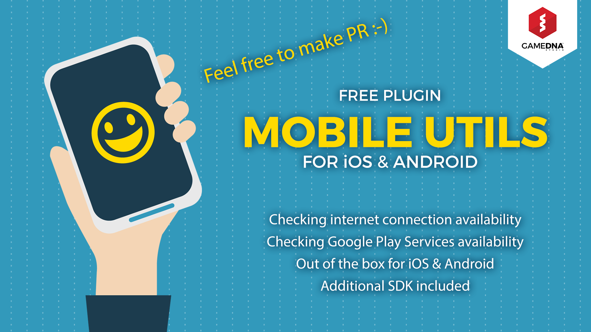
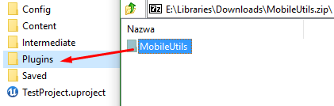
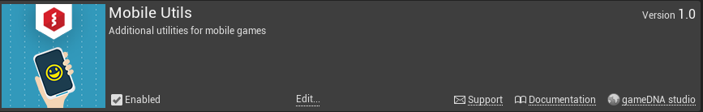
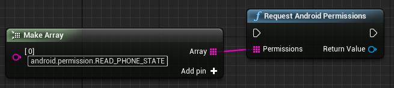

# Mobile Utils

**Mobile Utils** lets you integrate out-of-the-box mobile utilities for iOS & Android into an Unreal Engine 4 project. For example, it allows you to check an Internet connection and Google Play Services availability as well as get persistent Unique Device ID (you can identify users between application installations in order to, for example, store saved games in a cloud). This plugin is a mobile community initiative. Everyone can contribute and pull request with awesome new features to extend the editor and functionality of Unreal Engine 4.

We want to make a big mobile plugin with many features from community so feel free to make pull request! After review, if all is good, it will be merged into plugin. Thank you! :-)

* **Current version:** 1.12.0
* **Binaries compiled for:** Unreal Engine 4.23
* **Required Unreal Engine 4.23 or above.**

## Features
* Checking internet connection availability
* Checking Google Play Services availability
* Getting persistent Unique Device ID
* Retrieving Auth Token from Online Subsystem
* Works with dev & shipping builds
* Out-of-the-box for iOS & Android
* Additional SDK included
* Works with Blueprint-only & source code projects
* Works with Launcher & GitHub UE4 versions

## Setup
Copy this folder to the *Plugins* folder located in the main path of your project.

Enable *Mobile Utils* in *Edit -> Plugins -> Misc -> Mobile Utils*.

If you want to use *Get Persistent Unique Device Id* function on Android, you should request *READ_PHONE_STATE* permission:

If you can't do this, use *Get Device Id* function instead. In this case, device ID should be unique but it's not guaranteed.

# Recommended PR pipeline
* Write java and/or Obj-C code in Android Studio or XCode depending on the platform(s) you wish to add functionality to
* Test your code with a very simple app setup on your Android or iPhone
* Integrate your code to the plugin **without** creating an interface to blueprints
* Create a new sample project and test your code on a packaged project, at your desired device and platform
* If everything works correctly, perform a Pull Request
 
The reason that we prohibit you from creating a new blueprint node is to ensure cross platform compatibility as well as a uniform look and feel throughout the codebase. After your PR gets merged we will make sure that a new blueprint node is created if needed. We recommend trying to integrate your changes to the actual engine's master branch first and if your PR doesn't get merged, then resort to adding functionality to this plugin.

# Integration to the plugin
Here you will find the steps you need to take in order to add new functionality to this plugin.

## For Android
At /Source/MobileUtils/MobileUtils_APL.xml,
Add your tested java code:

* At <gameActivityImportAdditions>
		<insert>,
		insert your import(s) (check first if they do not exist on the GameActivity, at the actual engine).
* At <gameActivityClassAdditions>
		 <insert>,
		 insert your new methods. They should have the prefix "AndroidThunkJava_".

At /Source/MobileUtils/Private/Android/MobileUtilsPlatform.h,
Start integrating your code into the plugin:

* Declare your jmethodID(s) as well as function(s) with the appropriate names.

At /Source/MobileUtils/Private/Android/MobileUtilsPlatform.cpp,
Continue your integration:
* On the constructor, initialize that jmethodID you specified with FindMethod.
* Add your previously specified function along with the implementation like the other functions on that file.

And now, some extra intel. Do not be afraid to open up the source of Unreal and look into the Android related parts of the system as well as pull requests that add features to the android part. You can find more information about JNI method signatures [here!](http://www.rgagnon.com/javadetails/java-0286.html)

## For iOS
At /Source/MobileUtils/Private/IOS/MobileUtilsPlatform.h,
Start integrating your code into the plugin:

* Declare your variables as well as function(s) with the appropriate names.

At /Source/MobileUtils/Private/IOS/MobileUtilsPlatform.cpp,
Continue your integration:
* Add your previously specified function along with the implementation like the other functions on that file.

In UE4 iOS specific code should be written in Objective-C. Remember you can mix C++ code with Objective-C code!

# Testing the plugin
In order to test your changes, create a new project with your engine version of choise (although, it should be greater than our current minimum requirement~4.12),then clone the plugin at *Project Folder*/Plugins and then regenerate project files. The new folder "MobileUtils" should then be visible. After building the development editor you will be able to use code that you integrated or existing blueprint nodes. Note that this happens if you want to make a PR. If you are just looking to use the plugin, check the [releases](https://github.com/gameDNAstudio/MobileUtils/releases) page.

Plugin icon designed by _Freepik_.
